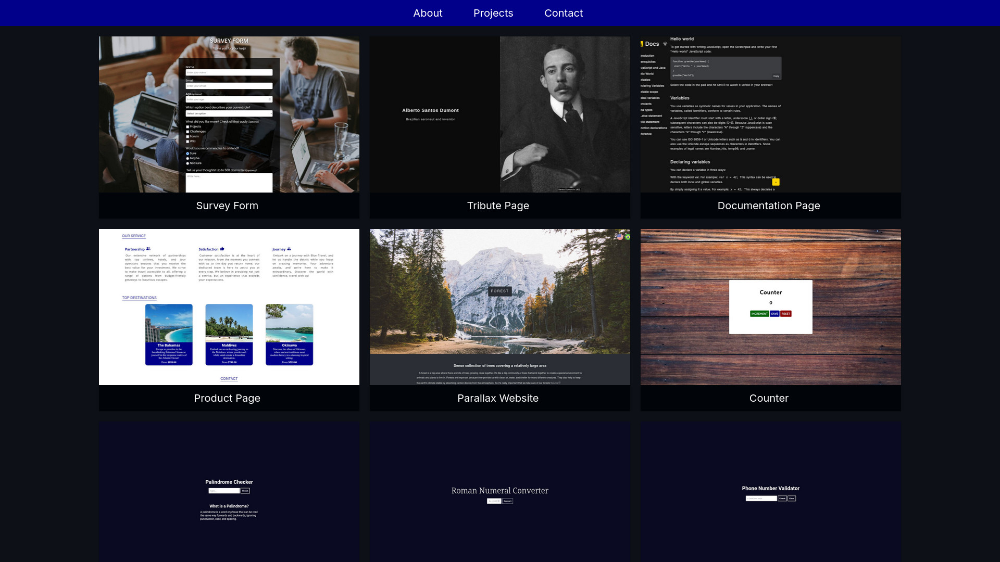

<!-- PROJECT LOGO -->
 

  

<h3 align="center">Adriano | Personal Portfolio</h3>

  

    My Web Design portfolio
     
     
    <a href="https://adrianogtl.github.io/fcc-personal-portfolio/">View Portfolio</a>
    ·
    <a href="https://www.freecodecamp.org/adrianogtl">freeCodeCamp</a>
  

## About The Project

- Objective: Build an app that is functionally similar to https://personal-portfolio.freecodecamp.rocks
- 5th certification project in freeCodeCamp's Responsive Web Design curriculum

## Resources

- Icons by [Icons8](https://icons8.com)

<a href="#readme-top">back to top</a>

